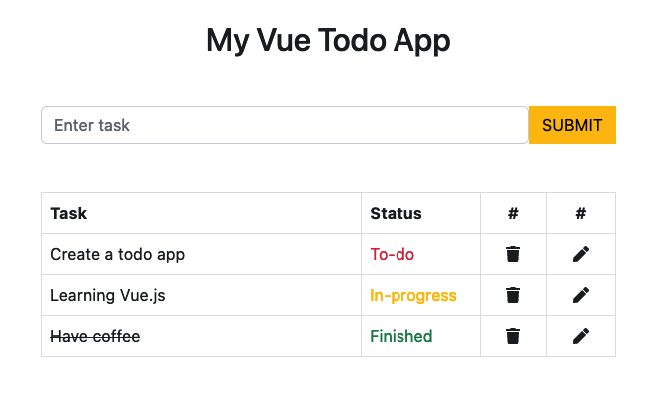

# Todo App Vue 2

This is just a simple exercise to practice Vue.js 2. <br>
<br>
The source tutorial video can be found here: https://github.com/ProgrammerNotesYT/vue-todo-app  <br>

<br>
To install and launch this project, clone and 

````
npm i
npm run dev
````


To create a new project using Vue2 (last version - 2.7 Naruto)<br>

````
npm init vue@2
````

